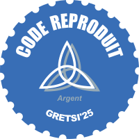

# SIMuLDiTex: a Single Image Multiscale and Lightweight Diffusion Model for Texture Synthesis
[Pierrick Chatillon](https://scholar.google.com/citations?user=8MgK55oAAAAJ&hl=en) | [Julien Rabin](https://sites.google.com/site/rabinjulien/) | [David Tschumperlé](https://tschumperle.users.greyc.fr/)


[Arxiv]() [Paper]() [HAL](https://hal.science/hal-04994907)

### Official pytorch implementation of the paper: "SIMuLDiTex: A Single Image Multiscale and Lightweight Diffusion Model for Texture Synthesis"

Examples of large scale synthesis, after training on the image displayed on the left:


Interpolation between 4 textures, synthesis of size 2048, downscaled by a factor 2, and compressed:


### Installation

These commands will create a conda environment called simulditex with the required dependencies, then place you in it :
```
conda env create -f requirements.yml
conda activate simulditex
```


### Pretrained models

This repo contains pretrained models under ./runs/ . Please refer to experiments.ipynb for further inference details. 


###  Training

Training parameters are described in the train.py parser.

```
python train.py --name <name_of_the_experiment> 
```

### Multi-GPU Training

As inherited from [this repo](https://github.com/lucidrains/denoising-diffusion-pytorch), the code is compatible with <a href="https://huggingface.co/docs/accelerate/accelerator">🤗 Accelerator</a>. You can easily do multi-gpu training in two steps using their `accelerate` CLI.

At the project root directory, run

```
accelerate config
```

Then, the multi-gpu training can be launched with

```
accelerate launch train.py --name <name_of_the_experiment> 
```
### Demo

*Demo implementation by [Mahé DUVAL](https://github.com/MarageDev)*


<br>

The repository contains a general demo file using the open-source Python package Gradio to render the user interface. The main demo file is located under : `Demos/demo.py`.

The demo includes 4 interactive experiments from the [Jupyter Notebook : experiments.ipynb](experiments.ipynb) : 
- Spatial Interpolation : blend two textures using a mask painted on the white canvas in real time
- Stylization : transfer the style of a texture to an uploaded image
- Interpolate two images : interpolate two images so the first image provides structure (coarse scales) while the second one gives texture (fine scales)
- Spatial linear interpolation : blend two textures from right to left with a linear gradient
#### How to run
To launch the demo, start the python script in the virtual environment :  
```shell
python ./Demos/demo.py
```
or use gradio hot reload mode (if you plan to edit the code) with 
```shell
gradio ./Demos/demo.py
```

After running one of these two commands, the models will be loaded and a local URL for the demo should appear. Open this URL to access the demos.
#### Additional information
To improve the responsiveness of the interface, you can:
- reduce `Scale factor`
- reduce `Total time step ratio`


For the stylization demo, it is possible to see the different scales with the slider below the `Output` image, from the start of the process to the final result
### Inference

All experiments with hyperparameters are replicable in the notebook experiments.ipynb.
The notebook saves the results in ./images/results/


### Acknowledgments
This was built upon the very useful [PyTorch diffusion implementaion](https://github.com/lucidrains/denoising-diffusion-pytorch), and this amazing signal resizing repo [ResizeRight](https://github.com/assafshocher/ResizeRight).

### Citation
If you use this code for your research, please cite our paper:

```

```


### Repo awarded the GRETSI 2025 reproductibility silver label [Label Reproductible du GRESTI'25](https://gretsi.fr/colloque2025/recherche-reproductible/)

| Label décerné | Auteur | Rapporteur | Éléments reproduits | Liens |
|:-------------:|:------:|:----------:|:-------------------:|:------|
|  | Pierrick CHATILLON<br>[@PierrickCh](https://github.com/PierrickCh) | Louise FRIOT GIROUX[@Louisefg](https://github.com/Louisefg) |  Figure 1<br>Figure 3 | 📌&nbsp;[Dépôt&nbsp;original](https://github.com/PierrickCh/SIMuLDiTex)<br>⚙️&nbsp;[Issue](https://github.com/GRETSI-2025/Label-Reproductible/issues/9)<br>📝&nbsp;[Rapport](https://github.com/akrah/test/tree/main/rapports/Rapport_issue_09) |


### License
This work is under the MIT license.

### Disclaimer
The code is provided "as is" with ABSOLUTELY NO WARRANTY expressed or implied.
